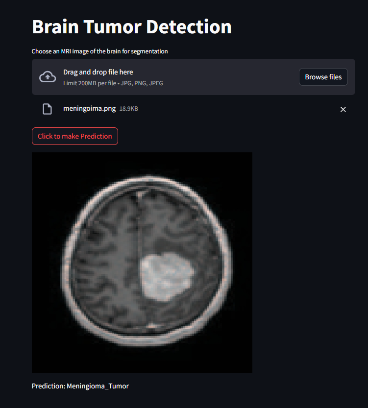

**Brain Tumor Detection using YOLOv8**

**Introduction:**
This project focuses on the classification of brain tumors using the YOLOv8 classification algorithm. The goal is to provide a reliable and efficient tool for medical professionals to assist in diagnosing brain tumors from MRI images.

**A Brief Overview:**
A brain tumor refers to an abnormal growth of cells within the brain or the surrounding tissues. These tumors can be either benign (non-cancerous) or malignant (cancerous), and they can originate from different types of brain cells, such as glial cells, meninges, or nerves.

**Types of Brain Tumors:**
1. **Primary Brain Tumors:** These tumors originate within the brain and can be benign or malignant. They are classified based on the type of cells they arise from.
2. **Secondary Brain Tumors:** Also known as metastatic brain tumors, these tumors originate from cancer cells that have spread (metastasized) from other parts of the body, such as the lungs, breast, or skin.

**Symptoms:**
The symptoms of a brain tumor can vary depending on its size, location, and rate of growth. Common symptoms may include:
- Headaches
- Seizures
- Nausea and vomiting
- Changes in vision, hearing, or speech
- Weakness or numbness in the limbs
- Cognitive or personality changes

**Diagnosis and Treatment:**
- Diagnosis typically involves a combination of imaging tests, such as MRI (Magnetic Resonance Imaging) or CT (Computed Tomography) scans, and a biopsy to examine a sample of the tumor tissue.
- Treatment options depend on factors such as the type, size, and location of the tumor, as well as the patient's overall health. Treatment may include surgery, radiation therapy, chemotherapy, or targeted drug therapy.
- The prognosis for brain tumors varies widely depending on factors such as tumor type, grade, and response to treatment.

**Files:**
- **Brain_Tumor_Classification_YOLOV8.ipynb**: This notebook contains the implementation of the YOLOv8 model for brain tumor detection. It was created using Google Colaboratory for ease of access and collaboration.
- **best.pt**: This file contains the trained weights of the YOLOv8 model after training on a dataset of brain MRI images.
- **main.py**: This Python script provides the main functionality of the brain tumor detection system. It loads the trained model and processes input images to detect tumors.
- **requirements.txt**: This file lists all the dependencies required to run the project. It ensures that the necessary libraries are installed in your environment.
- **result.png**: This image shows an example result of the brain tumor detection process.

**Getting Started:**
1. Clone the repository to your local machine: `git clone https://github.com/Eddy-Emmanuel/brain-tumor-detection.git`
2. Install the required dependencies by running: `pip install -r requirements.txt`
3. Run the `main.py` script to detect brain tumors in MRI images.

**Usage:**
- Ensure that you have Python installed on your system.
- Provide input MRI images to the `main.py` script.
- The script will output the detected brain tumors, if any, on the input images.

**Contributing:**
Contributions to improve the project are welcome! Feel free to fork the repository, make your changes, and submit a pull request.

**Acknowledgments:**
- This project was inspired by the need for efficient tools in medical imaging.
- Thanks to the developers of YOLOv8 and other open-source libraries used in this project.

**Result after testing**

